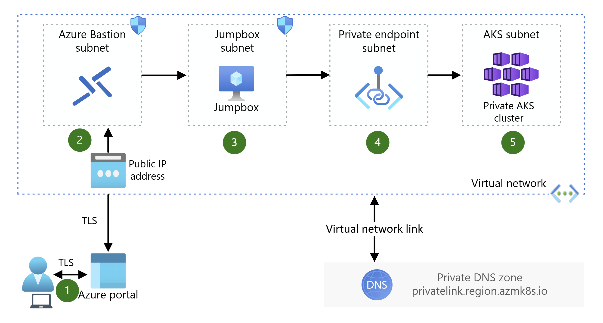
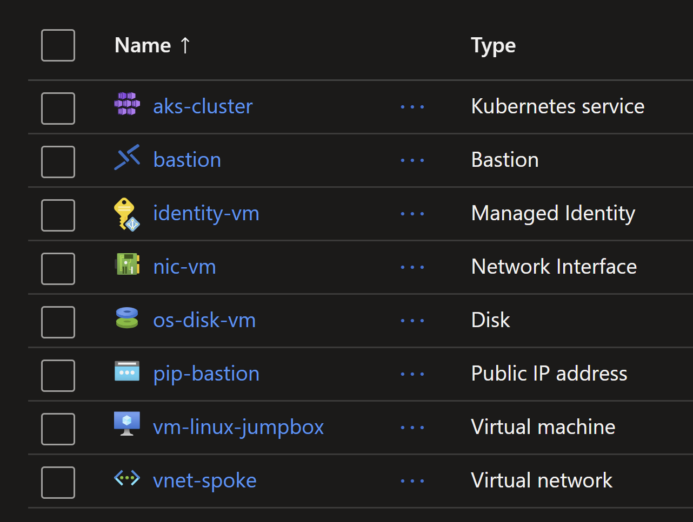
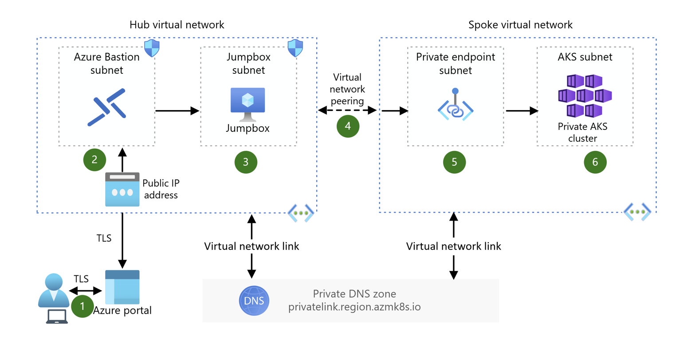

# Connecting to private AKS cluster using Azure Bastion

`Azure Bastion` is a fully managed PaaS service that provides secure and seamless `RDP` and `SSH` access to your virtual machines directly through the Azure Portal over `SSL`. When you connect via Azure Bastion, your virtual machines do not need a public IP address. Azure Bastion is provisioned directly in your Virtual Network (VNet) and supports all VMs in your `Virtual Network` (VNet) using SSL without any exposure through `public IP addresses`.

In this lab, you will learn how to connect to a private AKS cluster using `Azure Bastion`.



## Deploying resources using Terraform

You will use Terraform to deploy the following resources:

- Resource group
- Virtual network
- Azure Bastion
- Private AKS cluster
- Azure Linux VM acting as a Jumpbox
- User-assigned Managed Identity for the Jumpbox with RBAC role over the subscription

Run the following commands to deploy the resources:

```bash
terraform init
terraform plan -out tfplan
terraform apply tfplan
```

The following resources should be deployed.



## Connecting to the private AKS cluster

You can either use the Azure portal or the command line to connect to `private AKS`. In this lab, you will use the Azure CLI to connect to the private AKS cluster.
Run the following command to connect to the Azure VM using SSH through Bastion:

```bash
# get vm resource ID
az vm show -g rg-private-aks-bastion-260 -n vm-linux-jumpbox --query id -o tsv

# connect to the VM using Azure Bastion (replace the resource ID with the one you got from the previous command)
az network bastion ssh -n bastion -g rg-private-aks-bastion-260 --username azureuser --auth-type password --target-resource-id "/subscriptions/xxxxxxxxxxxxxxxxxxxxxxxxxxx/resourceGroups/rg-private-aks-bastion-260/providers/Microsoft.Compute/virtualMachines/vm-linux-jumpbox"
```

Once you are connected to the Azure VM, run the following command to connect to the private AKS cluster:

```bash
# login to your Azure subscription using the Managed Identity
az login --identity

# get the credentials of the AKS cluster
az aks get-credentials -g rg-private-aks-bastion-260 -n aks-private-260

# verify the connection
kubectl get nodes
```

## Azure Bastion in a Hub and Spoke model

Azure Bastion can be deployed in a hub and spoke model where the hub network contains the Azure Bastion and the spoke networks contain the resources that need to be accessed. This model provides a centralized and secure way to access resources in the spoke networks.

