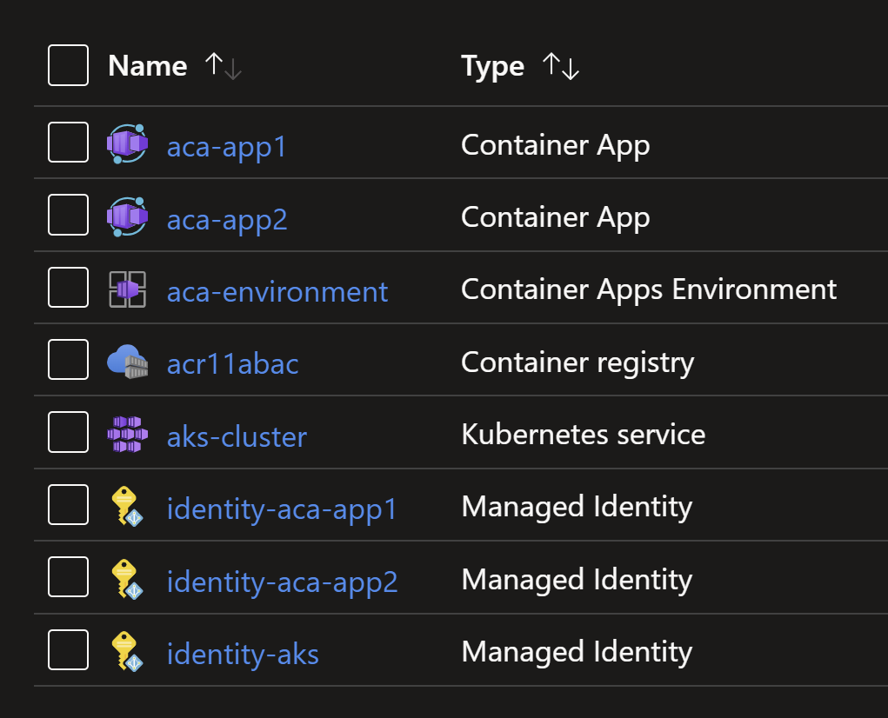

# Access-Based Access Control for ACR

`Azure attribute-based access control` (Azure `ABAC`) enables you to scope permissions within your registry by scoping roles to specific repositories. This approach enhances your security by allowing permissions for particular repositories, rather than the entire registry. This approach strengthens the security posture of your container registry by limiting access, thereby reducing the risk of unauthorized access or data breaches.

ABAC conditions can narrow down role assignment permissions to specific repositories within the registry based on set conditions. For example, you might grant access solely to repositories that start with a certain prefix or exactly match a given name, providing a more secure and controlled access management system.

To create role assignments with `ABAC` conditions, you must first switch to `ABAC-enabled` repository permissions mode in your registry settings.

## Enable the feature

To enable ABAC feature in your subscription:

```sh
az feature register --namespace Microsoft.ContainerRegistry --name AllowAttributeBasedAccessControl
```

## Deploy the resources

To deploy the resources, run the following `terraform` command:

```sh
terraform init
terraform plan
terraform apply
```

The following resources will be created:


