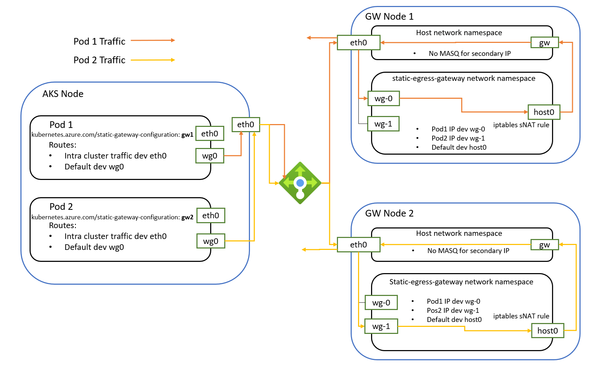

# AKS Egress Gateway


## Introduction

Static Egress Gateway in AKS provides a streamlined solution for configuring fixed source IP addresses for outbound traffic from your AKS workloads. This feature allows you to route egress traffic through a dedicated "gateway node pool". By using the Static Egress Gateway, you can efficiently manage and control outbound IP addresses and ensure that your AKS workloads can communicate with external systems securely and consistently, using predefined IPs.



There are some requirements for the nodepool:

* It will be configured with additional secondary IP configurations on its NIC by kube-egress-gateway operator, and each secondary IP * configuration is associated with a public IP prefix as outbound IP.
* It has a fixed maximum node size (public ip prefix size), and should have cluster auto-scaler disabled.
* It should be tainted (kubeegressgateway.azure.com/mode=true:NoSchedule) permanently so that no normal workload would land on it.
* It also has label kubeegressgateway.azure.com/mode: true for nodeSelector.
* The nodepool VMSS instances should be linux only.
* The cluster cannot use Azure CNI with Dynamic IP allocation as CNI plugin due to known issue.
* Deploying multiple gateway nodepools (multiple VMSSes) is supported. But single nodepool cannot contain multiple VMSSes.

Official documentation here: https://learn.microsoft.com/en-us/azure/aks/configure-static-egress-gateway
Public repository available here: https://github.com/Azure/kube-egress-gateway

## Demonstration

You will create an `AKS` cluster with a dedicated node pool for `egress` traffic. You will then configure a static egress gateway to route egress traffic through the dedicated `node pool`. You will also create a a `IP Prefix` to be used for the egress traffic. Finally, you will deploy a sample application to the AKS cluster and verify that the egress traffic is routed through the static egress gateway.

Create an AKS cluster with static egress gateway enables through flag `--enable-static-egress-gateway`.

```sh
$AKS_NAME = "aks-cluster"
$AKS_RG = "rg-aks-cluster-egress-gw"
$NODEPOOL_NAME = "npegress"
$GW_PREFIX_SIZE = 30

az group create --name $AKS_RG --location swedencentral

az aks create -g $AKS_RG -n $AKS_NAME --enable-static-egress-gateway --network-plugin azure --network-plugin-mode overlay -k 1.30.5 --node-vm-size standard_d2pds_v6 --vm-set-type VirtualMachineScaleSets

az aks get-credentials -g $AKS_RG -n $AKS_NAME --overwrite-existing
```

Check the default egress IP address of the AKS cluster.

```sh
# check default egress IP
# that is load balancer's outbound IP
kubectl run nginx --image=nginx
kubectl exec nginx -it -- curl ifconf.me
# 74.241.184.101
```

Create a static egress gateway nodepool.

```sh
az aks nodepool add -g $AKS_RG --cluster-name $AKS_NAME --name $NODEPOOL_NAME --mode gateway --node-count 2 --gateway-prefix-size $GW_PREFIX_SIZE --node-vm-size standard_d2pds_v6
```

Check the created `nodepool` and `internal load balancer`.


```sh

Create public IP prefix to be used by the static egress gateway.

```sh
az network public-ip prefix create -g $AKS_RG -n pip-prefix-egress --length $GW_PREFIX_SIZE
# get prefix
az network public-ip prefix show -g $AKS_RG -n pip-prefix-egress --query ipPrefix -o tsv
$IP_PREFIX_ID=$(az network public-ip prefix show -g $AKS_RG -n pip-prefix-egress --query id -o tsv)
echo $IP_PREFIX_ID
```

Check the created `IP Prefix`.


Create a static gateway configuration.

```sh
@"
apiVersion: egressgateway.kubernetes.azure.com/v1alpha1
kind: StaticGatewayConfiguration
metadata:
  name: my-static-egress-gateway
  namespace: default
spec:
  gatewayNodepoolName: $NODEPOOL_NAME
  publicIpPrefixId: $IP_PREFIX_ID
  excludeCidrs:  # Optional
  - 10.0.0.0/8
  - 172.16.0.0/12
  - 169.254.169.254/32
"@ > static_gateway_config.yaml

kubectl apply -f static_gateway_config.yaml

kubectl get staticgatewayconfigurations my-static-egress-gateway -n default -o yaml
```

Grant `Network Contributor` role to AKS cluster's identity.

```sh
$AKS_PRINCIPAL_ID=$(az aks show -g $AKS_RG -n $AKS_NAME --query identity.principalId -o tsv)

az role assignment create --role "Network Contributor" --assignee $AKS_PRINCIPAL_ID --scope $IP_PREFIX_ID
```

Deploy a sample application to the AKS cluster to use static egress gateway through annotation `kubernetes.azure.com/static-gateway-configuration: my-static-egress-gateway`. And verify that the egress traffic is routed through the static egress gateway.

```sh
kubectl apply -f deployment.yaml
kubectl get pods
kubectl exec <pod name> -it -- curl ifconfig.me
```
