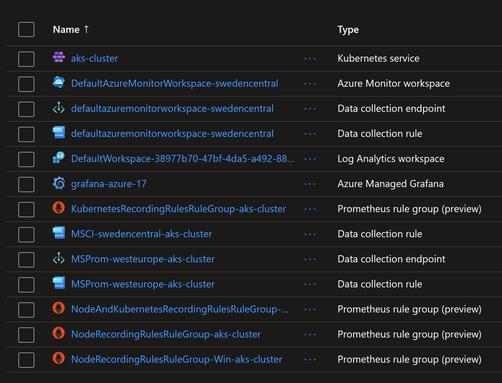

# Creating Grafana dashboards to visualize Azure Monitor logs

## Introduction

With AKS, you can use `Azure Monitor Workspace for Prometheus` and `Azure Managed Grafana` to collect, query and visualize the metrics from AKS.
And to collect logs, you can use `Azure Log Analytics`.

It is not common to use `Grafana` to visualize logs, but, technically it is possible !
And it is also useful for two reasons:
1. Use the same tool to look for metrics and logs, even in the same dashboard
2. `Azure Managed Grafana` have by default access to `Azure Monitor` which contains the logs

This lab will guide you to create a Grafana dashboard to view `AKS` logs from `Azure Monitor` and thus `Log Analytics`.

You will perform the following steps:

## 1. Deploy an `AKS` cluster with `Managed Grafana` and `Prometheus`.

You can do this either using using the following commands Azure cli

```sh
$RG="rg-aks-swc-85"

az group create -n $RG -l swedencentral

$log_analytics_id=$(az monitor log-analytics workspace create -g $RG --workspace-name log-analytics --query id -o tsv)

$prometheus_id=$(az monitor account create -n azure-prometheus -g $RG --query id -o tsv)

$grafana_id=$(az grafana create -n azure-grafana-15 -g $RG --query id -o tsv)

az aks create -n aks-cluster -g $RG --network-plugin azure --network-plugin-mode overlay -k 1.29.0 --enable-azure-monitor-metrics --enable-addons monitoring --azure-monitor-workspace-resource-id $prometheus_id --grafana-resource-id $grafana_id --workspace-resource-id $log_analytics_id


# az aks update -n aks-cluster -g $RG --grafana-resource-id $grafanaId

az aks get-credentials -n aks-cluster -g $RG
```

The following resources will be created.



## 2. Enable `ContainerLogV2` and logging from `kube-system` namespace

By default, logging from `kube-system` namespace is excluded. To enable it, you will need to use the custom `ConfigMap` provided by `AKS`.
It is called [`container-azm-ms-agentconfig.yaml`](https://raw.githubusercontent.com/microsoft/Docker-Provider/ci_prod/kubernetes/container-azm-ms-agentconfig.yaml).
More details in the [official documentation](https://learn.microsoft.com/en-us/azure/azure-monitor/containers/container-insights-agent-config).

Edit the file to make sure `exclude_namespaces` is empty and to enable `ContainerLogV2` by:
2.1. Replacing `exclude_namespaces = ["kube-system","gatekeeper-system"]` with `exclude_namespaces = []`
2.2. Setting the version to v2: `containerlog_schema_version = "v2"` 

>Note You can also enable multi-line logging by setting it to enabled:
```yaml
[log_collection_settings.enable_multiline_logs] 
  enabled = "true"
```

Then you can deploy the custom `ConfigMap`.

```sh
kubectl apply -f container-azm-ms-agentconfig.yaml
```

## 3. Verify logs are available in `Azure Monitor` through `Log Analytics`.

Run simple query like the following:

```yaml
ContainerLogV2
| limit 10 
```

## 4. Creating a Grafana dashboard

## 5. Publishing dashboard on Grafana marketplace

## 6. Importing the dashboard

```sh
az grafana dashboard import -n azure-grafana-15 --definition 20811
```

## Cleanup resources

To delete the creates resources, run the following command:

```sh
terraform destroy
```

## More readings

https://learn.microsoft.com/en-us/azure/azure-monitor/essentials/azure-monitor-workspace-manage?tabs=azure-portal
